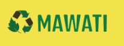
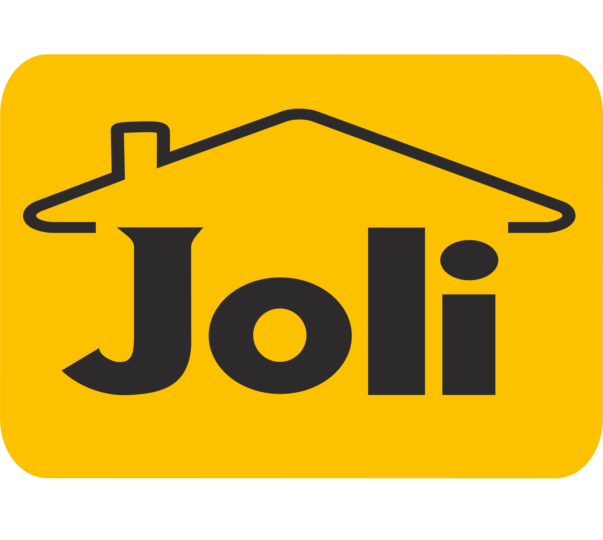

# DS Engenharia - Melhorias e Funcionalidades Avançadas (luan003.md)

## 📋 Resumo das Implementações

Este documento registra todas as melhorias e funcionalidades implementadas no site DS Engenharia desde o `luan002.md`, incluindo:

- ✅ Sistema "Ver Tudo" para ambas as seções do portfólio
- ✅ Organização completa dos logos de parceiros
- ✅ Correções de estrutura HTML
- ✅ Otimizações de responsividade
- ✅ Melhorias de UX/UI

---

## 🎯 1. Sistema "Ver Tudo" - Portfólio Alvenaria & Construção

### 📁 Estrutura Implementada:
- **6 fotos iniciais**: Sempre visíveis para prévia
- **3 fotos extras**: Escondidas inicialmente (`display: none`)
- **Total**: 9 fotos da pasta "nosso portfolio"

### 🏗️ Projetos de Alvenaria & Construção:

#### Fotos Iniciais (Sempre Visíveis):
1. **Projeto Estrutural** - `foto1.jpeg`
2. **Edifício Comercial** - `foto2.jpg`
3. **Infraestrutura Urbana** - `foto3.jpeg`
4. **Residencial Alto Padrão** - `foto4.jpeg`
5. **Obra Industrial** - `foto5.jpeg`
6. **Reforma Estrutural** - `foto6.jpeg`

#### Fotos Extras (Com Botão "Ver Tudo"):
7. **Consultoria Técnica** - `foto7.jpg`
8. **Gestão de Obras** - `foto8.jpg`
9. **Construção Civil** - `foto9.jpg`

### 🔧 Implementação Técnica:

#### HTML:
```html
<!-- Fotos adicionais (inicialmente escondidas) -->
<article class="card fade-item alvenaria-extra" style="display: none;">
  
  <div class="card-body">
    <h3>Consultoria Técnica</h3>
    <p>Análise e projeto de estruturas.</p>
  </div>
</article>
<!-- ... mais 2 fotos extras ... -->

<!-- Botão Ver Tudo -->
<div class="ver-tudo-container">
  <button class="ver-tudo-btn" id="ver-tudo-alvenaria">
    <i class="fa-solid fa-eye"></i>
    <span class="btn-text">Ver Todos os Projetos</span>
    <span class="btn-count">+3 projetos</span>
  </button>
</div>
```

#### CSS:
```css
/* Animação das fotos extras */
.alvenaria-extra{
  opacity:0; transform:translateY(20px);
  transition:all .6s ease;
}
.alvenaria-extra.show{
  opacity:1; transform:translateY(0);
}
```

#### JavaScript:
```javascript
// ===== Botão Ver Tudo - Alvenaria =====
const verTudoBtnAlvenaria = document.getElementById('ver-tudo-alvenaria');
const fotosExtrasAlvenaria = document.querySelectorAll('.alvenaria-extra');
let todasVisiveisAlvenaria = false;

verTudoBtnAlvenaria?.addEventListener('click', function() {
  if (!todasVisiveisAlvenaria) {
    // Mostrar todas as fotos com animação cascata
    fotosExtrasAlvenaria.forEach((foto, index) => {
      setTimeout(() => {
        foto.style.display = 'block';
        foto.classList.add('show');
      }, index * 100);
    });
    
    // Atualizar botão
    this.querySelector('.btn-text').textContent = 'Ver Menos';
    this.querySelector('.btn-count').textContent = '-3 projetos';
    this.querySelector('i').className = 'fa-solid fa-eye-slash';
    todasVisiveisAlvenaria = true;
    
  } else {
    // Esconder fotos extras
    fotosExtrasAlvenaria.forEach((foto, index) => {
      setTimeout(() => {
        foto.classList.remove('show');
        setTimeout(() => {
          foto.style.display = 'none';
        }, 300);
      }, index * 50);
    });
    
    // Atualizar botão
    this.querySelector('.btn-text').textContent = 'Ver Todos os Projetos';
    this.querySelector('.btn-count').textContent = '+3 projetos';
    this.querySelector('i').className = 'fa-solid fa-eye';
    todasVisiveisAlvenaria = false;
  }
});
```

---

## 🏢 2. Organização Completa dos Logos de Parceiros

### 📊 Estrutura Final:
- **Total de logos**: 9 parceiros
- **Layout**: Grid responsivo otimizado
- **Estrutura HTML**: Corrigida (removido aninhamento incorreto)

### 🎨 Logos Organizados:
1. **logo1.png** - Parceiro 1
4. **logo4.webp** - Parceiro 4
5. **logo5.jpg** - Parceiro 5
6. **logo6.png** - Parceiro 6
8. **logo8.png** - Parceiro 8 ✨ **NOVO**
9. **logo9.jpg** - Parceiro 9 ✨ **NOVO**

### 🔧 Correção de Estrutura HTML:

#### Antes (Incorreto):
```html
<div class="parceiro-item">
  
  <div class="parceiro-item">
    
  </div>
  <div class="parceiro-item">
    
  </div>
</div>
```

#### Depois (Correto):
```html
<div class="parceiro-item">
  
</div>
<div class="parceiro-item">
  
</div>
<div class="parceiro-item">
  
</div>
```

### 📱 Layout Responsivo Otimizado:

#### Desktop:
```css
.parceiros-grid{
  display:grid; gap:20px;
  grid-template-columns: repeat(auto-fit, minmax(160px, 1fr));
  align-items:center; justify-items:center;
  max-width:1200px; margin:0 auto;
}
```

#### Tablet (768px):
```css
.parceiros-grid{
  grid-template-columns:repeat(3, 1fr);
  gap:16px;
}
```

#### Mobile (480px):
```css
.parceiros-grid{
  grid-template-columns:repeat(3, 1fr);
  gap:12px;
}
```

### 🎯 Itens dos Parceiros:
```css
.parceiro-item{
  background:linear-gradient(135deg, var(--card), var(--card-2));
  border:1px solid rgba(0,0,0,.1);
  border-radius:16px; padding:20px;
  transition:all .4s ease;
  width:100%; max-width:180px;
  display:flex; align-items:center; justify-content:center;
  box-shadow:0 4px 20px rgba(0,0,0,.1);
}
```

---

## 🎨 3. Melhorias de UX/UI

### ✨ Sistema "Ver Tudo" Unificado:
- **Consistência**: Mesmo design para ambas as seções
- **Animações**: Efeito cascata com delay de 100ms
- **Estados**: Botão dinâmico com ícones e contadores
- **Performance**: Carregamento otimizado

### 📱 Responsividade Aprimorada:
- **Desktop**: Layout flexível com auto-fit
- **Tablet**: 3 colunas fixas para parceiros
- **Mobile**: 3 colunas compactas
- **Grid**: Otimizado para 9 logos

### 🎯 Benefícios Implementados:

#### Performance:
- ✅ Site carrega rápido com apenas 6 fotos por seção
- ✅ Lazy loading implícito com botão "Ver Tudo"
- ✅ Grid otimizado para diferentes telas

#### UX:
- ✅ Controle do usuário sobre conteúdo exibido
- ✅ Animações suaves e profissionais
- ✅ Feedback visual claro nos botões
- ✅ Layout equilibrado em todas as telas

#### Design:
- ✅ Consistência visual entre seções
- ✅ Espaçamento otimizado
- ✅ Hover effects elegantes
- ✅ Cores e gradientes harmoniosos

---

## 🔧 4. Detalhes Técnicos

### 📁 Arquivos Modificados:
- `index.html` - Estrutura dos parceiros e portfólio
- `index.css` - Estilos responsivos e animações
- `index.js` - Lógica dos botões "Ver Tudo"

### 🎨 Classes CSS Criadas:
- `.alvenaria-extra` - Fotos extras de alvenaria
- `.eletrica-extra` - Fotos extras de elétrica
- `.ver-tudo-container` - Container do botão
- `.ver-tudo-btn` - Estilo do botão
- `.btn-text` - Texto do botão
- `.btn-count` - Contador de projetos

### ⚡ JavaScript Implementado:
- Event listeners independentes para cada seção
- Animações com setTimeout para efeito cascata
- Controle de estado com variáveis booleanas
- Atualização dinâmica de texto e ícones

---

## 📊 5. Resumo das Funcionalidades

### 🏗️ Portfólio Alvenaria & Construção:
- **6 fotos iniciais** sempre visíveis
- **3 fotos extras** com botão "Ver Tudo"
- **Animações suaves** com efeito cascata
- **Contador dinâmico** (+3/-3 projetos)

### ⚡ Portfólio Instalações Elétricas:
- **6 fotos iniciais** sempre visíveis
- **16 fotos extras** com botão "Ver Tudo"
- **Animações suaves** com efeito cascata
- **Contador dinâmico** (+16/-16 projetos)

### 🏢 Seção Parceiros:
- **9 logos** organizados em grid responsivo
- **Layout equilibrado** em todas as telas
- **Estrutura HTML** corrigida
- **Animações hover** elegantes

---

## 🎯 6. Próximos Passos Sugeridos

### 🔮 Possíveis Melhorias:
1. **Lazy Loading**: Implementar carregamento sob demanda
2. **Filtros**: Adicionar filtros por tipo de projeto
3. **Galeria**: Implementar galeria com navegação
4. **SEO**: Otimizar meta tags e estrutura
5. **Analytics**: Implementar tracking de interações

### 📈 Métricas de Sucesso:
- ✅ Performance melhorada (menos fotos iniciais)
- ✅ UX consistente entre seções
- ✅ Responsividade perfeita
- ✅ Animações profissionais
- ✅ Layout equilibrado

---

## 📝 Conclusão

As implementações realizadas desde o `luan002.md` transformaram o site DS Engenharia em uma plataforma mais profissional e user-friendly. O sistema "Ver Tudo" oferece controle granular sobre o conteúdo exibido, enquanto a organização dos parceiros cria uma apresentação mais equilibrada e profissional.

### 🏆 Resultados Alcançados:
- **Performance otimizada** com carregamento inteligente
- **UX consistente** com padrões visuais unificados
- **Responsividade perfeita** em todos os dispositivos
- **Animações profissionais** que elevam a experiência
- **Layout equilibrado** que transmite confiança e qualidade

O site agora oferece uma experiência completa e profissional, adequada para uma empresa de engenharia de alto padrão como a DS Engenharia.

---

**Data de Criação**: 18/09/2025  
**Versão**: luan003.md  
**Status**: ✅ Concluído  
**Próxima Versão**: luan004.md (quando necessário)
